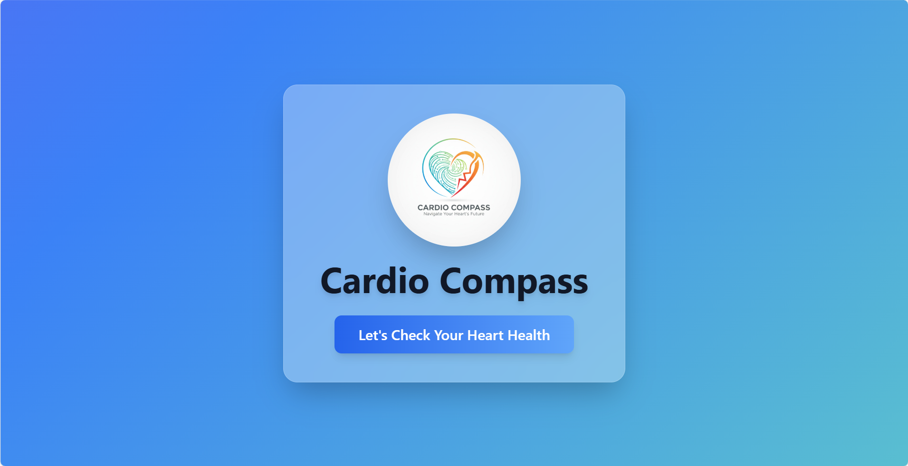
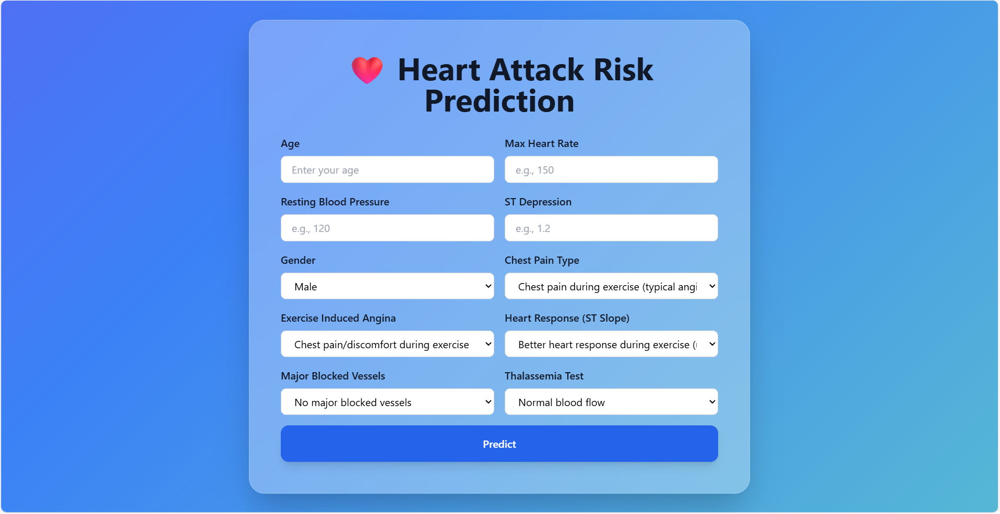

# 🫀 Heart Attack Risk Prediction Web App

An interactive web application built using **Python (Flask)**, **HTML**, **CSS**, and **JavaScript** to predict the **risk of heart attack** based on various medical parameters.  
This project uses a **Machine Learning model** trained on cardiovascular data to analyze patient health and predict the likelihood of heart disease.

---

## 🌐 Live Demo
👉 [Add your deployed link here]  

---

## 🖼️ Project Preview

<div align="center" style="display: flex; justify-content: center; gap: 10px;">
  
  
</div>

---

## 🧠 Project Description

This web app predicts whether a person is likely to experience a **heart attack** based on input features such as age, cholesterol, blood pressure, and other health metrics.  
The app takes user input through a clean web interface, processes it using a **Flask backend**, and displays the **prediction result** instantly.

---

## 📊 Dataset Overview

The model is trained using a structured dataset with 14 health-related features:

| Feature | Description |
|----------|--------------|
| **age** | Age of the patient (in years) |
| **sex** | Gender (`1 = Male`, `0 = Female`) |
| **cp** | Chest pain type (`0: Typical Angina`, `1: Atypical Angina`, `2: Non-anginal Pain`, `3: Asymptomatic`) |
| **trtbps** | Resting blood pressure (in mm Hg) |
| **chol** | Serum cholesterol level (in mg/dl) |
| **fbs** | Fasting blood sugar > 120 mg/dl (`1 = True`, `0 = False`) |
| **restecg** | Resting electrocardiographic results (`0: Normal`, `1: ST-T wave abnormality`, `2: Left ventricular hypertrophy`) |
| **thalachh** | Maximum heart rate achieved |
| **exng** | Exercise induced angina (`1 = Yes`, `0 = No`) |
| **oldpeak** | ST depression induced by exercise relative to rest |
| **slp** | Slope of the peak exercise ST segment (`0: Upsloping`, `1: Flat`, `2: Downsloping`) |
| **caa** | Number of major vessels colored by fluoroscopy (0–3) |
| **thall** | Thalassemia (`1: Normal`, `2: Fixed defect`, `3: Reversible defect`) |
| **output** | Target variable (`1 = Heart Disease`, `0 = No Disease`) |

---

## ⚙️ Tech Stack

| Technology | Purpose |
|-------------|----------|
| **Python** | Core programming language |
| **Flask** | Backend web framework for handling routes and logic |
| **HTML5** | Structure of web pages |
| **CSS3** | Styling and responsive design |
| **JavaScript** | Enhancing interactivity in the frontend |
| **scikit-learn / Pandas / NumPy** | For model training and data processing |

---

## 🔄 Workflow

1. **Data Collection & Preprocessing**  
   - Cleaned and normalized health data.  
   - Handled missing or invalid values.

2. **Model Training**  
   - Trained a machine learning model (e.g., Logistic Regression / Random Forest / SVM).  
   - Evaluated accuracy and performance metrics.

3. **Flask Integration**  
   - Model saved using `pickle` or `joblib`.  
   - Flask routes used for handling user requests and predictions.

4. **Frontend Design**  
   - HTML form collects user input.  
   - CSS ensures a clean and responsive layout.  
   - JavaScript handles form validation and smooth transitions.

5. **Prediction Output**  
   - The result is displayed dynamically (e.g., *"High Risk"* or *"Low Risk"*) with visual indicators.

---

## 📁 Project Structure

```bash
Heart-Attack-Risk-Prediction/
│
├── dataset/                      # Contains datasets used for training and analysis
│   ├── Correlation_Check_data.csv
│   ├── Heart_clean_data.csv
│   └── heart.csv
│
├── models/                       # Trained model files
│   └── random_forest_new2.pkl
│
├── notebooks/                    # Jupyter notebooks for EDA and model training
│   ├── EDA.ipynb
│   └── Model_Training.ipynb
│
├── static/
│   └── images/                   # Static assets (e.g., logo)
│       └── logo.jpg
│
├── templates/                    # HTML templates for Flask routes
│   ├── index.html                # Main prediction form
│   └── landing.html              # Home/landing page
│
├── application.py                # Main Flask application file
├── requirements.txt              # Python dependencies
└── README.md                     # Project documentation

---

## 🛠️ Installation & Setup

**1️⃣ Clone the Repository**

```bash
git clone https://github.com/chandank013/heart-attack-risk-prediction.git
cd heart-attack-risk-prediction

---

2️⃣ Create a virtual environment (optional but recommended)

python -m venv venv
source venv/bin/activate   # for Linux/Mac
venv\Scripts\activate      # for Windows

3️⃣ Install dependencies

pip install -r requirements.txt

4️⃣ Run the Flask app

python app.py

5️⃣ Open in your browser

http://127.0.0.1:5000

---

## 🧑‍💻 Team Members

| Name | Roll No. | Contributions |
|------|-----------|---------------|
| **Chandan Kumar** | 24BDS013 | Designed frontend, handled backend logic, and integrated Flask routes. |
| **Nitish Naveen** | 24BDS050 | Trained the ML model, tested, validated, and optimized app performance. |
| **Anchal Jaiswal** | 24BDS003 | Performed data preprocessing and feature engineering. |

---

📈 Future Enhancements

🩺 Integration with real-time ECG or smartwatch data

🌐 Deploy on cloud (Vercel / Render / Heroku)

📊 Add visualization dashboards using Chart.js or Plotly

🧠 Improve model accuracy with larger datasets

---

💡 Author

Team Risk-Predictor

Built with ❤️ using Python, Flask, HTML, CSS, and JavaScript.